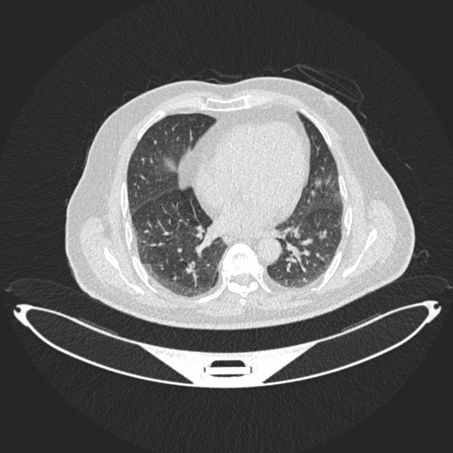
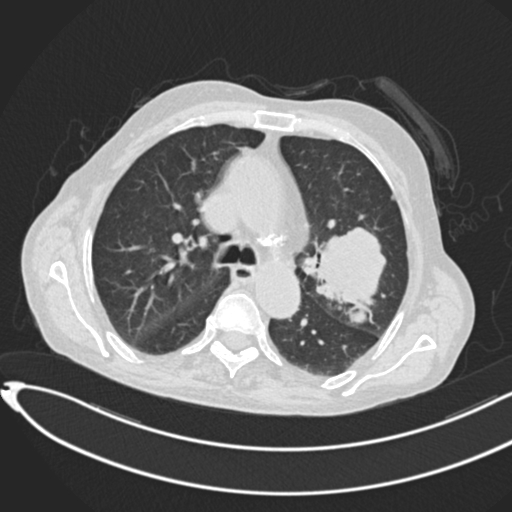
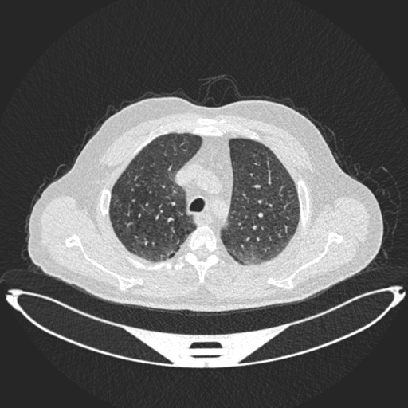

# Lung Cancer Detection 
Classification of different lungs conditions such as Normal, Malignant, and Benign. Bokeh dashboard to classify Ct scan images of lungs into the desired 3 classes. 

## Installation
Install python and the packages listed below:
#==========================================
pip install python==3.8.3
pip install bokeh==2.1.1
numpy==1.19.5
pandas==1.0.5
tensorflow==2.4.1
keras==2.4.3

After installing the packages. Clone this repo and Run the command <"bokeh serve bokehApp"> to run the server on local default browser  .
## CT Scans of Lungs

